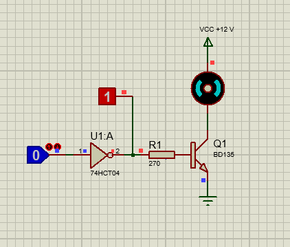

Diseño de un circuito para activar un pequeño motor DC que funciona a 12 V y que necesita una
corriente de 400 mA mediante una puerta inversora 74HCT04 con salida a nivel "H" (ALTO).
Transistor BJT utilizado: BD135
