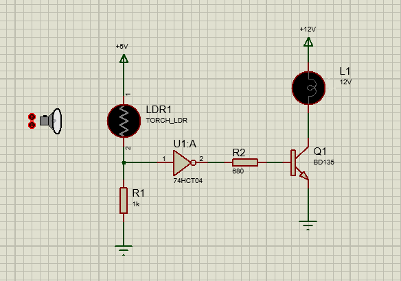

Circuito para controlar el encendido y apagado de una lámpara incandescente de
12V/2W mediante un sensor de luz LDR, de forma que en claridad (LDR = 200 Ω) la
lámpara permanezca apagada y en oscuridad (LDR = 10 KΩ) la lámpara permanezca encendida.
Transistor BJT usado: BD135

