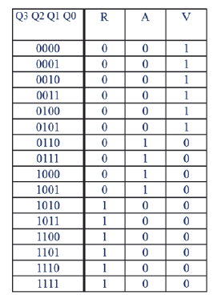
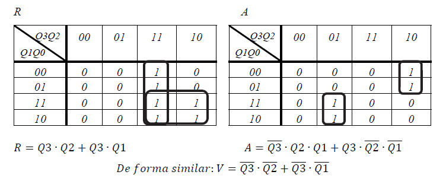
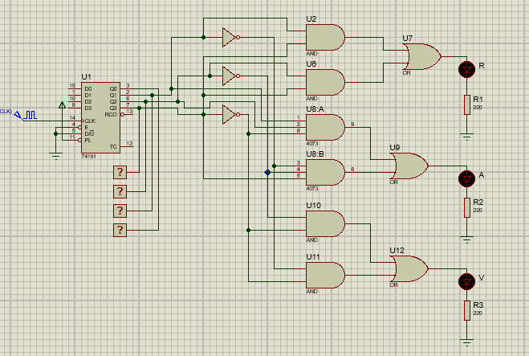

Diseño de un circuito de control de un "semáforo" cuya secuencia de encendido "1" y apagado "0"
de las luces roja, amarilla y verde (R, A, V) se indican en la tabla de verdad.

## Mapas de Karnaugh

## Circuito

