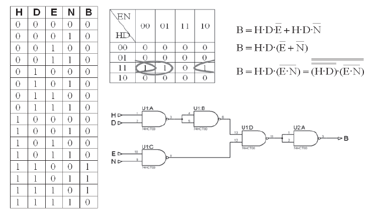
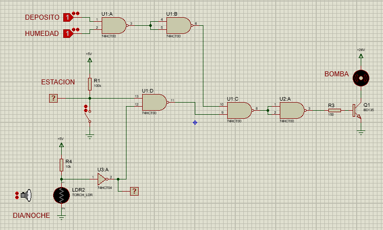

Se desea controlar una estación de riego compuesta por un depósito de agua y una
bomba de impulsión (B). El circuito a diseñar deberá activar la bomba (señal B) con un
nivel lógico alto cuando se necesite realizar el riego. Con el fin de controlar el proceso,
se incluyen los siguientes elementos:
- Detector de nivel del depósito (D). Proporciona un nivel lógico bajo (L) si el depósito
de agua está vacío y un nivel alto (H) si el depósito está lleno.
- Sensor de humedad (H). Para controlar el estado del suelo se dispone de un sensor
de humedad que proporciona un nivel lógico alto si el campo necesita ser regado
y un nivel bajo (L) si el terreno está húmedo.
- Interruptor de estación (E). El interruptor se coloca en una de sus dos posiciones
en función de la estación del año (interruptor abierto = primavera-verano = “1” lógico;
interruptor cerrado = otoño invierno = ”0” lógico).
- Detector de día/noche (N). Se utiliza una LDR que presenta una resistencia en
oscuridad > 10 KΩ y de día < 1 kΩ. Proporciona un “1” lógico durante el día y un
“0” lógico durante la noche.

La bomba B se deberá activar si el suelo está seco y hay agua en el depósito (con el fin
de evitar que se averíe la bomba al funcionar en vacío). En las estaciones cálidas solo
se podrá regar de noche, mientras que en el resto de las estaciones se podrá hacer en
cualquier momento.

Se pide:
- Obtener el circuito lógico para la activación de la bomba (utilizar puertas NAND
de dos entradas).
- Diseñar las conexiones del interruptor de estación para que cumpla las especificaciones
dadas.
- Diseñar el circuito de la LDR para que cumpla las especificaciones dadas.
- Si la bomba utilizada es de 24V, 1A, Diseñar el circuito de activación necesario
utilizando un transistor bipolar de propósito general con βsat = 50 y VBEsat = 1 V.

Utilizar las puertas NAND de la familia 74HCT

## Circuito lógico

