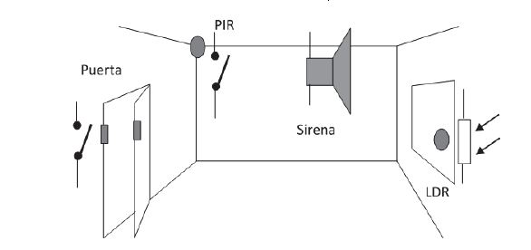
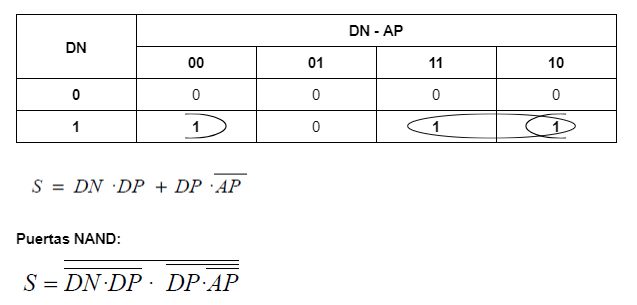
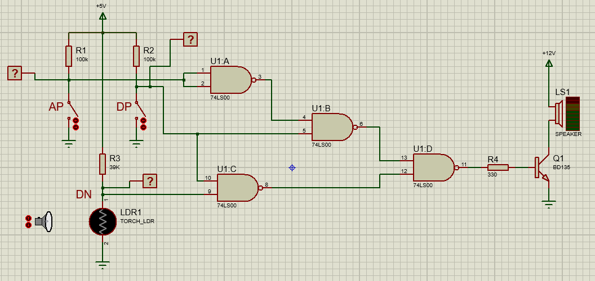

Diseño de un circuito electrónico para la instalación de seguridad de un aula-laboratorio.
Esta conformado por 3 sensores y un actuador:

## Sensores
- Detector de presencia (DP). Sensor PIR que actúa sobre un contacto que está
normalmente cerrado y al detectar la presencia de un ser vivo se abre.
- Detector de apertura de puerta (AP). Contacto magnético que activa un interruptor.
Si la puerta está cerrada el interruptor está cerrado. Si la puerta está
abierta el interruptor está abierto.
- Detector de día/noche (DN). Se utiliza una LDR para detectar si es de día
(LDR=1KΩ) o de noche (LDR=50KΩ).

## Actuador
- Sirena eléctrica (S) de 12V, 3W.

La alarma se debe activar en las siguientes condiciones:
- Si es de día, la puerta está cerrada y hay presencia de gente.
- Si es de noche y hay presencia de gente.

Para la realización del circuito se utilizaron puertas NAND de dos entradas
74LS00 de la familia TTL.

Se pide:
- Diseñar los circuitos de adaptación del sensor PIR para que en presencia de
gente proporcione un “1” lógico y del detector magnético para que con la puerta
cerrada proporcione un “0” lógico.
- Diseñar el circuito de adaptación de la LDR para que durante el día suministre
un “0” lógico y durante la noche un “1” lógico.
- Diseñar el circuito de excitación de la sirena desde una puerta lógica de forma
que cuando esta proporcione un “1” lógico la sirena se active. Utilizar transitor BJT BD135.
- Diseñar el circuito lógico para el funcionamiento descrito.

## Diseño Lógico

