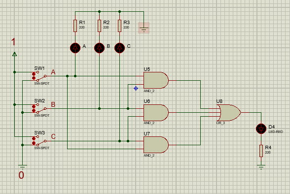

# Máquina de Votación
Circuito lógico de un sistema de votación de un jurado de 3 miembros (A, B y C).
Cada miembro vota 0 o 1. La salida del circuito es una lámpara o LED (F). 
Esta lámpara estará encendida cuando la mayoría de los miembros del jurado vote 1
y estará apagada cuando la mayoría vote 0.

