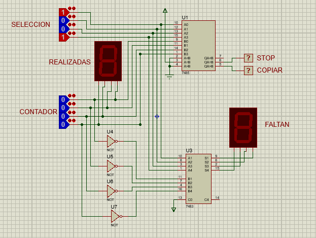

Circuito para el control de una máquina fotocopiadora.
Esta máquina tiene una seleccion del número de copias a realizar (Preset)
de un maximo de 9 copias y un contador del número de copias realizadas.
El sistema determina cuando la máquina tiene que parar (STOP).
Además, indica el número de copias realizadas y las que faltan por hacer.

