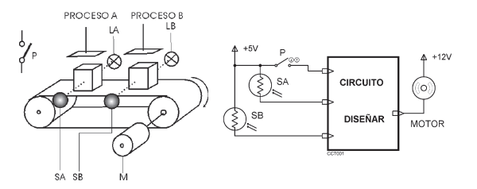
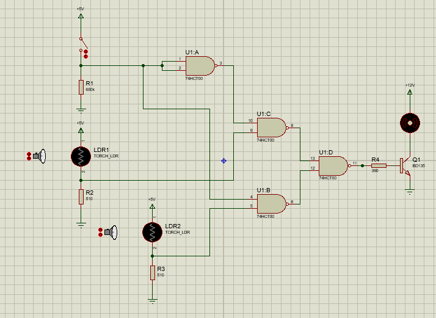

Diseño de un sistema de Transporte de Objetos formado por:
- Un pequeño motor DC (12V, 300 mA) que hace girar una cinta transportadora.
- Dos barreras fotoeléctricas (A y B) formadas cada una por una lámpara y
un sensor de luz (LA-SA y LB-SB). Los sensores son LDR con R luz (no se detecta objeto) = 200 Ω
y R oscuridad (se detecta objeto) = 5 kΩ
- Un interruptor P que determina el funcionamiento del sistema.

El funcionamiento del sistema es el siguiente:
- Si “P” está abierto el control del sistema lo determina la barrera A. Es decir, si
un objeto corta la barrera A (oscuridad), el motor se detiene para realizar un proceso A e
ignora a la barrera B.
- Si “P” está cerrado el control del sistema lo determina la barrera B. Es decir, si
un objeto corta la barrera B (oscuridad), el motor se detiene para realizar un proceso B e
ignora a la barrera A.
- Si no se detecta ningún objeto (luz) el motor estará en funcionamiento permanentemente.

